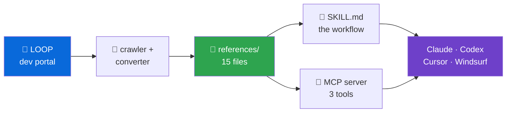
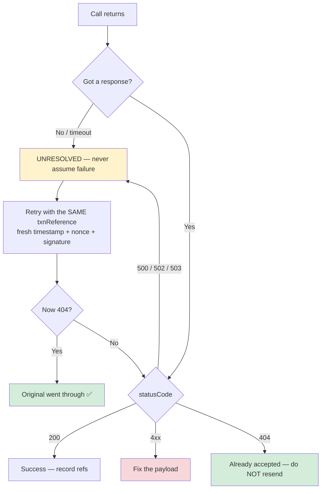

<div align="center">


# 🇰🇪 LOOP API Skill

### Ask your AI coding assistant about the LOOP API — and get real answers, not invented ones.

<sub><i>An unofficial, community-built developer tool. Not affiliated with, endorsed by, or supported by LOOP or NCBA.</i></sub>

<br>

[](LICENSE)
[](tests/test_pipeline.py)
[](skills/loop-api/references/)
[](skills/loop-api/references/signing.md)

[](#-works-with-your-tools)
[](#-works-with-your-tools)
[](#-works-with-your-tools)
[](#-works-with-your-tools)
[](#-works-with-your-tools)

</div>

---

## 😤 The problem

You ask an AI assistant how to send money to M-Pesa using LOOP. It answers instantly,
confidently, and **completely wrong** — an endpoint that doesn't exist, a field name it
made up, an error code from a different bank entirely.

You only find out forty minutes later, staring at a `401`.

This happens because LOOP is a small, local API. The model has barely seen it, so it
fills the gap with something that *sounds* right.

## 💡 What this fixes

This skill gives your assistant the **actual LOOP documentation** and one hard rule:

> **Never state a LOOP endpoint, field, or error code from memory.**
> Every claim must come from a file that records the page it came from and the date.

When something isn't documented, the assistant is told to say _"the docs don't cover
this — here's the page to check"_ instead of guessing.

```
you  ▸ can I pay 40 suppliers in one API call?

ai   ▸ reading references/coverage.md, references/send-money-mpesa.md …

       No — every Send Money call is one recipient. There is no bulk endpoint
       in the documentation, so you'd loop 40 calls and reconcile them yourself.

       Two things that will bite you:
       • Each call needs its own unique txnReference. On a timeout you must
         retry with the SAME one — a new one can pay twice.
       • The gateway returns HTTP 200 even when a payment fails. Branch on
         statusCode inside the body.

       Source: send-money-mpesa.md → sandbox.loop.co.ke/devportal/docs/loop-api
```

---

## ✅ What it does / ❌ What it doesn't

Being straight with you, because a tool that oversells itself wastes your time.

<table>
<tr><th width="50%">✅ It does</th><th width="50%">❌ It does not</th></tr>
<tr valign="top"><td>

- Answers **"is this possible with LOOP?"** from the real docs
- **Walks you through authorisation** — how to get a token, why it expires, why a stale one looks like a signing bug
- Tells you **which endpoint** to call, and in what order
- Gives you **request bodies with correct field names**
- Explains **what an error code actually means**
- Flags the places **LOOP's own docs contradict themselves**
- Shows you the **source page** for every claim
- Runs **fully offline** after install

</td><td>

- **Does not hold your API keys.** It explains *how* to authenticate; it never stores, reads, or transmits a credential of yours.
- **Does not call the LOOP API.** It reads documentation. It cannot move money.
- **Does not test your integration.** It cannot tell you if your code works — only whether it matches the docs.
- **Is not official.** Not built or endorsed by LOOP or NCBA.
- **Is not a contract.** For fees, limits and settlement, confirm with LOOP.
- **Does not cover 2 of 13 pages** — see [`coverage.md`](skills/loop-api/references/coverage.md).

</td></tr>
</table>

> [!IMPORTANT]
> **It teaches auth. It never handles your credentials.**
> The skill fully documents LOOP's OAuth 2.0 flow — see
> [`authorisation.md`](skills/loop-api/references/authorisation.md) — so it can tell you
> exactly how to get a token and why yours is being rejected.
>
> What it will not do is hold one. No code in this repository sends a request to LOOP,
> reads an API key, or stores a token. The only thing touching the network is the
> documentation downloader, and only to fetch public doc pages. Your keys stay yours.

---

## 🚀 Get started in 60 seconds

```bash
git clone https://github.com/imodoiepale/unleashed-loop.dev-skill
cd unleashed-loop.dev-skill

# From YOUR project folder, install into your assistant:
python /path/to/unleashed-loop.dev-skill/tools/install.py --harness claude
```

Swap `claude` for `codex`, `cursor`, `windsurf`, or `mcp`. That's it — no build step,
no API key, no account.

Then just ask, in plain English:

<table>
<tr><td>💬</td><td><i>"How do I get an access token for the LOOP sandbox?"</i></td></tr>
<tr><td>💬</td><td><i>"How do I collect a payment from a customer with LOOP?"</i></td></tr>
<tr><td>💬</td><td><i>"Why does my request return 401 when my signature looks right?"</i></td></tr>
<tr><td>💬</td><td><i>"What's the difference between Pay to Till and Send Money?"</i></td></tr>
<tr><td>💬</td><td><i>"Can I send money to a bank account, not M-Pesa?"</i></td></tr>
<tr><td>💬</td><td><i>"My payment timed out. Do I retry it?"</i></td></tr>
</table>

You don't need to name an endpoint. The skill switches itself on when you mention LOOP,
NCBA Loop, a till, a paybill, PesaLink, or a payment problem.

---

## 💰 Six things that cost real money

These are the traps in LOOP's API. Your assistant now knows all of them.

<table>
<tr valign="top"><td width="30">🚨</td><td>

**HTTP 200 does not mean success.**
The gateway returns `200` for failures too. `if (response.ok)` will record failed
payments as successful. Branch on **`statusCode` inside the body**.

</td></tr>
<tr valign="top"><td>💸</td><td>

**Retrying wrong pays twice.**
On a timeout, retry with the **same** `txnReference`. A new one can send the money
again. A "duplicate" rejection is good news — it means the first one worked.

</td></tr>
<tr valign="top"><td>🔑</td><td>

**It says "RSA signing guide". It is not RSA.**
Every page repeats that line. The real scheme is **HMAC-SHA256** with a shared secret.
Go hunting for a key pair and you'll lose an afternoon.

</td></tr>
<tr valign="top"><td>🔁</td><td>

**Transaction Inquiry retries backwards.**
Every payment endpoint says *reuse* your reference on retry. Inquiry needs a **fresh**
one on every poll. Get it backwards and every check after the first fails.

</td></tr>
<tr valign="top"><td>⏱️</td><td>

**Token lifetime is documented as both 900 and 3600 seconds.**
Two different pages, two different numbers. Read `expires_in` from the live response.

</td></tr>
<tr valign="top"><td>📍</td><td>

**Signing fields go *inside* `requestParameters`.**
Not at the top level. This is a documented cause of a `400` with an unhelpful message.

</td></tr>
</table>

**[→ All 15 documentation conflicts](skills/loop-api/references/doc-conflicts.md)**

---

## 📚 What's in the box


<div align="center">



</div>

**11 documentation pages**, plus four files that don't exist in LOOP's docs at all —
they're the reason this beats reading the portal yourself:

| 📄 File | What it gives you |
| :--- | :--- |
| 🔬 **[`api-flows.md`](skills/loop-api/references/api-flows.md)** | **What every API actually does**, as sequence diagrams — see below. |
| 🧭 **[`conventions.md`](skills/loop-api/references/conventions.md)** | The rules that stop you double-paying: the `statusCode` bands, the envelope, the retry logic. **Read this first.** |
| 🔐 **[`signing.md`](skills/loop-api/references/signing.md)** | The HMAC scheme all 9 endpoints share — with LOOP's 4 test vectors, **all recomputed and verified**. Check your code against these before touching sandbox. |
| ⚠️ **[`doc-conflicts.md`](skills/loop-api/references/doc-conflicts.md)** | 15 places LOOP's docs disagree with themselves. Check here before assuming your code is wrong. |
| 🕳️ **[`coverage.md`](skills/loop-api/references/coverage.md)** | What's missing, so the assistant says *"not captured"* instead of *"doesn't exist"*. |

### The 9 endpoints, and when to use each

**Step 0 — authorise. Nothing else works until this does.** 🔑

| You want to… | Use |
| :--- | :--- |
| Get the Bearer token every other call needs | [**Authorisation**](skills/loop-api/references/authorisation.md) |

<table><tr valign="top"><td width="30">🔑</td><td>

Every LOOP call carries `Authorization: Bearer <token>`. You get that token with
**OAuth 2.0 client credentials**: base64 your Consumer Key and Secret, send them as
`Basic <encoded>` with `grant_type=client_credentials` form-encoded. Tokens are
short-lived — **minutes, not hours**.

Sandbox keys are issued **instantly**. Production keys need **approval**, which is a
lead time, not a code problem — and it's usually the real answer to *"why can't I go
live yet?"*

Two traps live here, both documented:
**(a)** an expired token is rejected *before* your signature is checked, so a stale
token looks exactly like a signing bug;
**(b)** the Authorisation page's own "Request Examples" block **cannot work** — it asks
for a token while presenting one. Use the Basic-auth form.

</td></tr></table>

**Getting paid** 📥

| You want to… | Use |
| :--- | :--- |
| Ask a customer to pay you | [LOOP Prompt](skills/loop-api/references/loop-prompt.md) — pushes to the LOOP app |

**Paying out** 📤 — pick by what the destination *is*:

| Destination | Use |
| :--- | :--- |
| 📱 Someone's LOOP wallet | [Send Money — LOOP](skills/loop-api/references/send-money-loop.md) |
| 📲 Someone's M-Pesa | [Send Money — M-Pesa](skills/loop-api/references/send-money-mpesa.md) |
| 🏦 Someone's bank account | [Send Money — PesaLink](skills/loop-api/references/send-money-pesalink.md) |
| 🏪 A LOOP merchant till | [Pay to LOOP Till](skills/loop-api/references/pay-to-loop-till.md) |
| 🛒 An M-Pesa buy-goods till | [Pay to M-Pesa Till](skills/loop-api/references/pay-to-mpesa-till.md) |
| 🧾 An M-Pesa paybill | [Pay to M-Pesa Paybill](skills/loop-api/references/pay-to-mpesa-paybill.md) |

**Checking what happened** 🔍

| You want to… | Use |
| :--- | :--- |
| Find out if a payment went through | [Transaction Status Inquiry](skills/loop-api/references/transaction-status-inquiry.md) |

---

## 🔬 See exactly what the APIs are doing

**[`api-flows.md`](skills/loop-api/references/api-flows.md)** breaks every operation
down into sequence diagrams, so you can see where money moves and where a failure
happened — instead of guessing from an error code.

### The order the gateway runs its checks

**No money leaves your till until every check passes.** This is why the error code tells
you exactly how far your request got:

| # | Check | Fails with | Money moved? |
| :-: | :--- | :--- | :--- |
| 1 | Bearer token valid | `401` | No |
| 2 | Till registered to you | `401` | No |
| 3 | Signature / timestamp / nonce | `401` | No |
| 4 | Fields, amount, phone format, channel | `400` | No |
| 5 | `txnReference` not already used | `404` | **Already did, earlier** |
| 6 | Recipient exists on the rail | `461` `464` `422` | No |
| 7 | Execute the transfer | `462` | No |
| ✅ | Success | `200` | **Yes** |

That `404` is the one that surprises people: it doesn't mean *nothing happened*, it
means *this already happened*. On a retry, it's **confirmation of success**.

### Deciding whether to retry



### Validating an idea before you build it

The file carries a full table. A sample:

| Your idea | Verdict |
| :--- | :--- |
| Let customers pay in my app | ✅ Documented — LOOP Prompt + callback |
| Pay salaries to bank accounts | ✅ Documented — Send Money PesaLink, one call each |
| Pay 200 suppliers in one call | ⚠️ **No bulk endpoint** — 200 calls, you own the sequencing |
| Pay everyone automatically each Friday | ⚠️ **No scheduler** — your cron, not LOOP's |
| Check my till balance first | ❌ Not documented |
| Refund a payout | ❌ Not documented — payouts are non-reversible |
| Collect from a customer on M-Pesa | ❓ Page exists, not captured — check the portal |

**❌ means "the docs don't cover it", not "impossible."** The skill is instructed to say
so, and to point you at LOOP support — never to invent an endpoint to be helpful.

---

## 🧰 Works with your tools

| Tool | Install | What it writes |
| :--- | :--- | :--- |
| 🟠 **Claude Code** | `--harness claude` | `.claude/skills/loop-api` |
| ⚫ **Codex** | `--harness codex` | `AGENTS.md` (adds to yours, keeps your text) |
| 🔵 **Cursor** | `--harness cursor` | `.cursor/rules/loop-api.mdc` |
| 🟢 **Windsurf** | `--harness windsurf` | `.windsurf/rules/loop-api.md` |
| 🟣 **Anything MCP** | `--harness mcp` | Prints config to paste |

One source of truth, five native formats. Re-running is safe — it won't duplicate or
overwrite anything you wrote.

---

## 🇰🇪 New to payment APIs? Start here

No shame in this — the vocabulary is half the battle.

| Word | What it means |
| :--- | :--- |
| **Till** | The number customers pay when they "buy goods". Yours identifies your business. |
| **Paybill** | Like a till, but the payer also types an account number (your electricity meter, an invoice). |
| **PesaLink** | The rail that moves money **between Kenyan banks**, using a phone number. |
| **Sandbox** | A practice environment. Same behaviour, **fake money**. Always start here. |
| **Endpoint** | One specific web address you send a request to, for one specific job. |
| **Token** | A short-lived pass you get before calling the API. Expires in minutes. |
| **Idempotency** | Making sure that sending the same request twice doesn't pay twice. LOOP does this with `txnReference`. |
| **Callback / webhook** | LOOP calling *your* server to tell you something finished. Only LOOP Prompt uses one. |
| **Nonce** | A random one-time value proving a request is fresh, not a replay. Never reuse one. |

> [!TIP]
> **Always build in sandbox first.** Sandbox behaves like production but moves no real
> money. In production, payouts are **not reversible** — there is no undo.

---

## 🔄 Keeping the docs current

> [!NOTE]
> **How this copy was captured.** The build machine couldn't reach
> `sandbox.loop.co.ke`, so the maintainer supplied the page text and it was
> **transcribed by hand**. The content is LOOP's, but it hasn't been machine-checked
> against the live pages — a typo is possible in a way it wouldn't be for a crawl.
>
> Every file records this in a `capture:` header, and the skill is told to flag it when
> an exact value is about to move real money. The signing scheme is the exception: all
> four of LOOP's published test vectors were recomputed and match exactly.

To replace it with a machine-verified copy, from any machine that can reach the portal:

```bash
./tools/setup.sh
```

That finds LOOP's Swagger file if one exists (better than any scrape), falls back to a
`wget` mirror, and switches to a headless browser if the portal renders client-side. It
also picks up the two pages this copy is missing.

A change in `references/` is a change in LOOP's API. Read those diffs carefully.

<details>
<summary><b>Using the crawler on a different docs site</b></summary>

Nothing in the pipeline is LOOP-specific beyond its defaults:

```bash
BASE=https://docs.example.com \
DOCS_PATH=/api \
START_PAGE=/api/introduction \
./tools/crawl_loop.sh .cache/example-docs

python tools/ingest_docs.py --input-dir .cache/example-docs/pages --out my-references
```

`DOCS_PATH` is the fence — the crawl won't leave it, which keeps you out of the site's
login flow.

</details>

---

## 🤝 Contributing

Found something wrong? A doc conflict resolved by LOOP support? A page we're missing?
**Please open an issue.** Especially valuable: an answer from `apisupport@loop.co.ke`
settling one of the 15 conflicts.

One rule: [**don't write API facts from memory**](CONTRIBUTING.md). Every claim must
trace to a page you actually read. That rule is the only reason this is worth trusting.

```bash
pip install -r tools/requirements.txt pytest
python -m pytest tests/ -q                              # 24 tests
python skills/loop-api/scripts/validate_skill.py        # provenance check
```

---

## 📜 Licence & honesty

**MIT** — free for anyone, for anything. See [LICENSE](LICENSE).

This is a **community project**. It is not published, reviewed, or endorsed by LOOP or
NCBA. The references are a snapshot of public documentation, not a contract. When
correctness genuinely matters — settlement, fees, limits, compliance — **confirm with
LOOP directly** at `apisupport@loop.co.ke`.

**Trademarks.** LOOP, NCBA and their logos belong to their respective owners. They are
used here only to identify which API this skill documents — nominative use, not a claim
of affiliation or approval. The MIT licence covers this project's own code and writing,
not those marks.

<br>

<div align="center">

<a href="https://nsait.co.ke">
  
</a>

### Created by [**NSAIT.CO.KE**](https://nsait.co.ke)

#### Nairobi Space of AI Tools

<sub>Built &amp; maintained by <b>Epale</b> &amp; <b>Chrisben</b> </sub>


<br>

[](https://nsait.co.ke)
[](https://www.linkedin.com/in/jamesepale/)
[](https://www.tiktok.com/@b0ijimi)
[](https://github.com/imodoiepale)
[](https://github.com/chrisleo-16)

<sub>Made in Nairobi 🇰🇪 · for developers building on LOOP</sub>

<br>

⭐ **If this saved you an afternoon, star the repo so the next developer finds it.**

</div>
