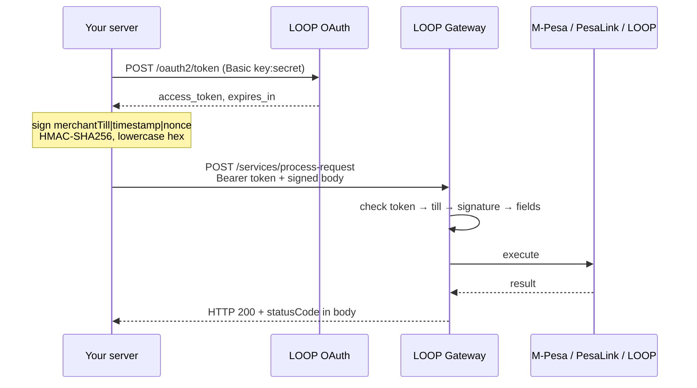
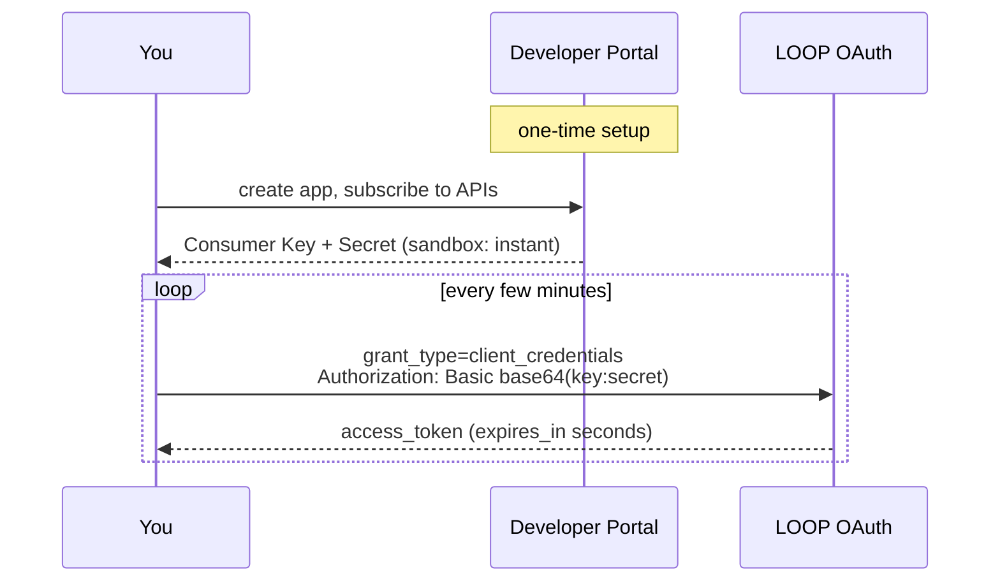
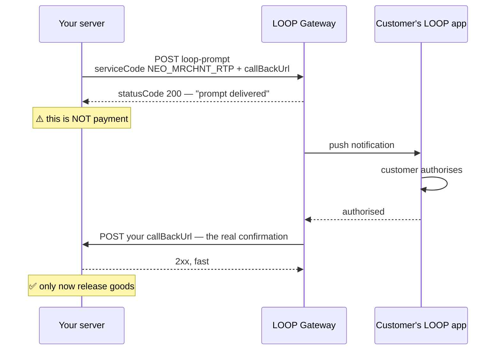
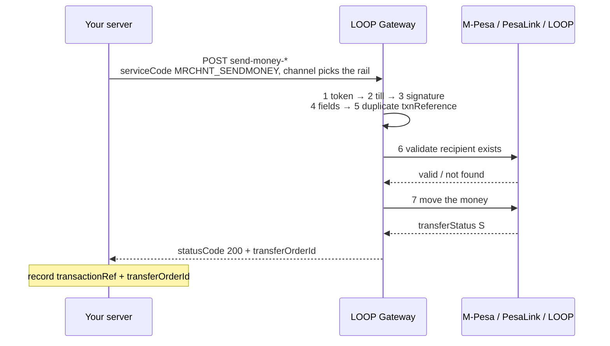
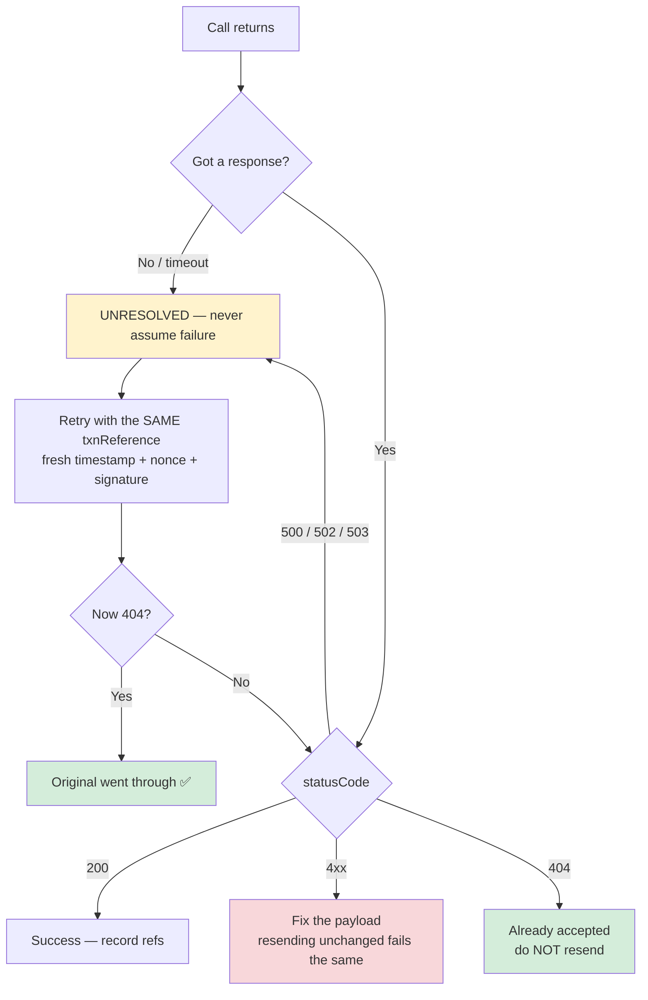
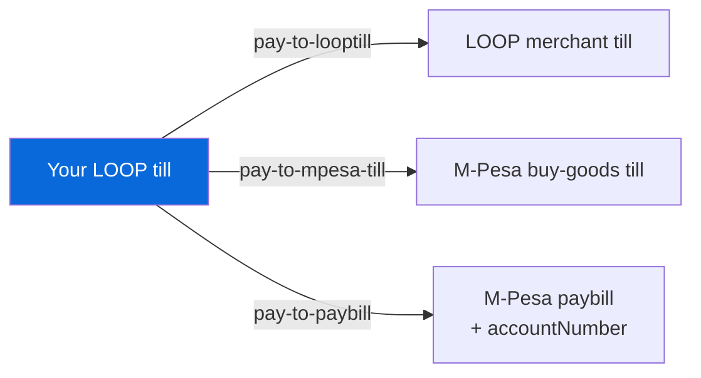
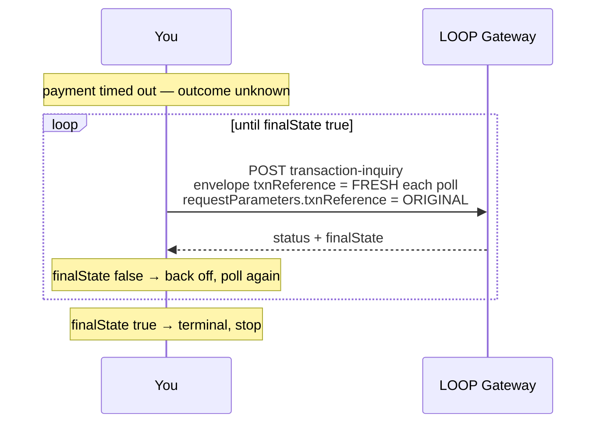

<!-- source: https://sandbox.loop.co.ke/devportal/docs/loop-api/ (integration steps across all endpoint pages) -->
<!-- fetched: 2026-08-13 -->
<!-- capture: manual-transcription -->
<!-- derived: true — flows reconstructed from the numbered "Integration steps" on each endpoint page -->

# What the APIs actually do — flow by flow

> Source: <https://sandbox.loop.co.ke/devportal/docs/loop-api/> (analysed 2026-08-13)
> Reconstructed from the numbered "Integration steps" that each endpoint page carries.

Use this to understand the shape of a flow before writing code, and to work out **where
in the flow a failure happened** when debugging.

---

## The shape shared by every call

All nine endpoints follow one pattern. Learn it once.

**Three things to notice**, each a common source of bugs:

1. **The token is checked before the signature.** An expired token fails a request that
   is otherwise perfectly signed — so a `401` is an auth problem before it is a
   crypto problem.
2. **The signature covers only `merchantTill|timestamp|nonce`.** Not the amount, not the
   recipient. TLS is what protects those.
3. **The HTTP status is almost always 200.** The real answer is `statusCode` in the body.

---

## Flow 1 — Getting a token

| Step | Detail |
| --- | --- |
| Encode | `base64(consumer_key + ":" + consumer_secret)` |
| Send | `Authorization: Basic <encoded>`, body `grant_type=client_credentials`, form-encoded |
| Receive | `access_token`, `token_type: Bearer`, `expires_in` |
| Use | `Authorization: Bearer <access_token>` on every call |

**Lifetime is short — minutes.** Refresh on the `expires_in` you actually receive; the
docs state 900 in one place and 3600 in another. Full detail:
[`authorisation.md`](./authorisation.md).

---

## Flow 2 — Collecting money (LOOP Prompt)

The only flow with a callback. Money comes **in**.

**The trap.** The synchronous `200` means *the prompt was delivered*, not *the customer
paid*. Releasing goods on it ships product for free.

**Handling the callback:** acknowledge with a `2xx` quickly, stay **idempotent on
`transactionRef`** (assume it can arrive twice), and treat only the callback as proof.

> The callback body schema (`CompletionCallbackPayload`) is **not** in this corpus — see
> [`coverage.md`](./coverage.md). Get it from the portal's Swagger before building the
> handler.

---

## Flow 3 — Paying money out (Send Money)

No callback. Fully synchronous. Money goes **out** — and is **not reversible**.

### The gateway's checks run in order and fail fast

**No money leaves your till until every check passes.** This is why the error code tells
you exactly how far the request got:

| Order | Check | Fails with | Money moved? |
| --- | --- | --- | --- |
| 1 | Bearer token valid | `401` | No |
| 2 | Till registered to you | `401` | No |
| 3 | Signature / timestamp / nonce | `401` | No |
| 4 | Required fields, amount, phone format, channel | `400` | No |
| 5 | `txnReference` not already used | `404` | **Already did, earlier** |
| 6 | Recipient exists on the rail | `461` / `464` / `422` | No |
| 7 | Execute the transfer | `462` (no instrument) | No |
| — | Success | `200` | **Yes** |

A `404` is the odd one out: it does not mean *nothing happened*, it means *this already
happened*. On a retry, that is confirmation of success.

### The retry decision

> **Never retry with a new `txnReference`.** You do not know whether the first attempt
> executed. Same reference = safely refused if it did. New reference = **paid twice**.

Switching rails after a decline (`MPESA` → `PESALINK`) is a **new attempt** and needs a
**new** reference — that is not a retry.

---

## Flow 4 — Paying a till or paybill (Pay to *)

Same envelope, `serviceCode: MRCHNT_PAYMENTS`, no callback. Money goes **out**, to a
business rather than a person.

The difference between them is only **what the destination is**. Picking wrong gives a
`422` (paybill) or a generic decline.

`accountNumber` matters most for paybill — it is the reference the operator expects
(customer account, invoice, meter number) and **varies per paybill**.

---

## Flow 5 — Resolving an unknown outcome

When a payment call times out, this is how you find out what happened.

### The two-reference trap

LOOP's own docs call this the most common mistake on this endpoint:

| Field | Identifies | Changes per poll? |
| --- | --- | --- |
| **Envelope** `txnReference` | *this inquiry call* | **Yes — fresh every time** |
| `requestParameters.txnReference` | *the original payment* | **No — always the same** |

Reuse the envelope reference and every poll after the first fails with `404`.

**Retries are inverted here.** Payment endpoints reuse the reference; this one needs a
fresh one — because it is read-only, so retrying can never double-charge.

---

## Validating an idea before you build

Match what you want against what the documentation supports:

| Your idea | Verdict | Route |
| --- | --- | --- |
| Let customers pay in my app | ✅ Documented | LOOP Prompt + callback |
| Pay a supplier's M-Pesa | ✅ Documented | Send Money — M-Pesa |
| Pay salaries to bank accounts | ✅ Documented | Send Money — PesaLink, one call each |
| Settle a utility bill automatically | ✅ Documented | Pay to M-Pesa Paybill |
| Reconcile payments against a ledger | ✅ Documented | Transaction Status Inquiry + `transferOrderId` |
| Pay 200 suppliers in one call | ⚠️ **No bulk endpoint** | 200 calls; you own sequencing, rate, reconciliation |
| Pay everyone automatically each Friday | ⚠️ **No scheduler** | Your cron; LOOP has no scheduling primitive |
| Check my till balance first | ❌ **Not documented** | `462` implies balance is enforced, but no balance endpoint is captured |
| Refund / reverse a payout | ❌ **Not documented** | Payouts are described as non-reversible |
| Know the fee before sending | ❌ **Not documented** | Fees exist, drawn from your till on top of `amount`; no published rates |
| Collect from a customer on M-Pesa, not LOOP | ❓ **Page exists, not captured** | "LOOP M-Pesa Prompt" — check the portal |
| List transactions for a period | ❓ **Page exists, not captured** | "Transaction History" — check the portal |

✅ documented · ⚠️ possible, but you build the missing part · ❌ not in the docs ·
❓ likely supported, this corpus does not cover it

**Do not report ❌ as "impossible".** It means the captured documentation does not cover
it — ask LOOP support. See [`coverage.md`](./coverage.md).

---

## Build order that works

1. **Get a token.** Nothing else runs until this does.
2. **Reproduce a published signature** from [`signing.md`](./signing.md). Same inputs,
   same output — before any live call. Repeated bad signatures trigger a lockout.
3. **Make one read-only call** — Transaction Status Inquiry against any reference. It
   proves auth + signing + connectivity without moving money.
4. **Then the smallest real call**, in sandbox, with the smallest amount.
5. **Handle failures before going live**: timeout → same reference; `4xx` → fix payload;
   `404` → already done.
6. **Log `txnReference`, `transactionRef` and `transferOrderId` together** for every
   call. `transferOrderId` reconciles against a statement; `transactionRef` is what
   support asks for.

Production credentials require **approval**, which is a lead time rather than a code
problem — start that early.
